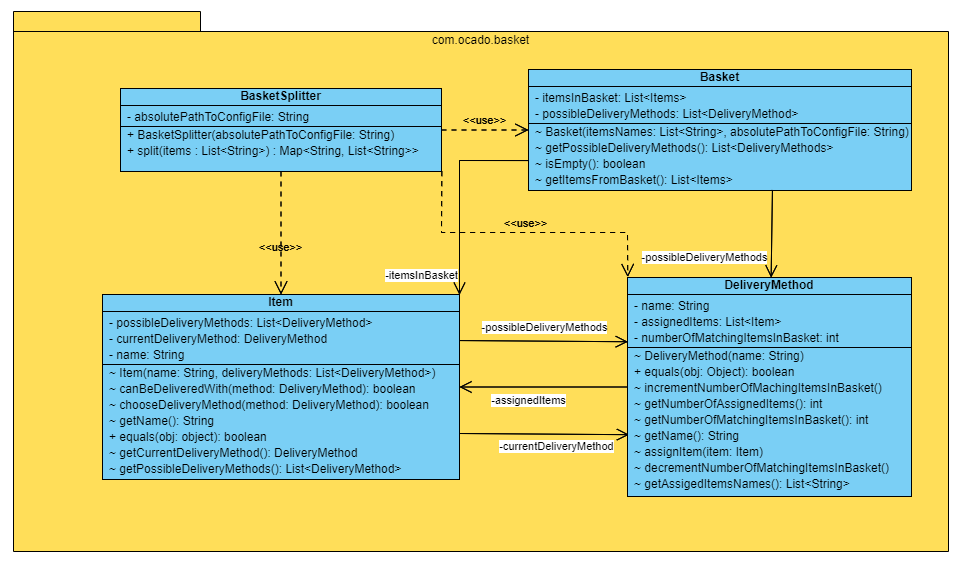

# basket-splitter

Java library that solves optimization problems by splitting items from a customer's order among multiple delivery methods. The project was commissioned by *Ocado* as a recruitment task.

## Analysys

### Problem description

Each product in the shop's offer requires different delivery methods. Thus it's crucial to find an algorithm that would analyse each customer's order and assign its elements to their proper delivery methods. What's more, it needs to be done as optimally. Order **elements should be split among as few delivery methods as possible**. Additionally, **number of items assigned to the method with the maximal amount of assignments should be as big as possible**.

### Input data

1. Customer's order (basket) in the form of items' names list. Example basket form:

```json
[ "product-name-1", "product-name-2", "product-name-3" ]
```

2. Configuration file in `JSON` format that contains a list of all products in the shop's offer and defines lists of names of their proper delivery methods. Implemented **library would require an absolute path to this file**. Example configuration file contents:

```json
{
  "product-name-1": [ "delivery-method-1", "delivery-method-2" ],
  "product-name-2": [ "delivery-method-1" ],
  "product-name-3": [ "delivery-method-2" ],
  "product-name-4": [ "delivery-method-1", "delivery-method-3" ]
}
```

### Required output

A map that would represent the assignment of the order's products between delivery methods. **Delivery method name should be a key** and **list of products' names assigned to it should be a value**. Example output:

```json
{
  "delivery-method-1": [ "product-name-1", "product-name-2" ],
  "delivery-method-2": [ "product-name-3" ]  
}
```

### Constraints

* Shop's offer would contain at most 1000 products
* There would be at most 10 different delivery methods
* Customer's basket would contain at most 100 different products

## Implementation

The library was implemented with *Java 17* enriched by an external [*Jackson*](https://github.com/FasterXML/jackson) library (for easier parsing of `JSON` files). The class structure of the implemented library is shown in figure XXX.


